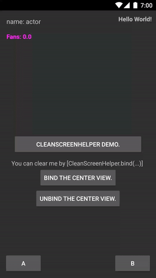

# ClearScreenHelper

［[中文](#)］［[English](https://github.com/Yellow5A5/ClearScreenHelper/blob/master/README.md)］

在我们的日常开发中，偶尔会遇到清屏相关的需求（更多的是在视频类的App中）。一般主要的方式都是通过点击某个按钮后对部分UI进行隐藏，而淘宝直播都是通过手指滑动界面来实现清屏的，相比之下感觉后者这样的交互方式会更加友好。

针对类似淘宝直播的滑动清屏的方式，一般可以将这些需要被隐藏的功能按钮统一放在一层View上，然后直接操作最外层的View，就这样的方法而言，代码维护起来比较麻烦，另外对原来的界面改动会比较多。因此，为了解决这样类似的问题，在此实现了一个统一的解决工具ClearScreenHelper。

## 引入

第一步：

```
	allprojects {
		repositories {
			...
			maven { url "https://jitpack.io" }
		}
	}
```

第二步：

```
	dependencies {
	        compile 'com.github.Yellow5A5:ClearScreenHelper:1.0.2'
	}
```

## 介绍


通过ClearScreenHelper进行滑动清屏功能实现有一下优点：

> * **对原有的逻辑代码及界面文件改动极小**
> * **通过对其内部的View进行绑定，动态设置需要移除的控件**
> * **逻辑维护起来十分方便，几行代码完美解决问题**

效果见下方右图：

</img>
</img>

## 调用姿势(两种方式)

### 方式一［<font color="##669966">推荐</font>］ (替换你的顶层Layout)


#### 步骤1、在XML中替换掉你的最外层Layout

| 原始最外层Layout | 替换后Layout   | 
| :------:   | :-----:  |
| RelativeLayout | RelativeRootView |
| LinearLayout| LinearRootView|
| FrameLayout | FrameRootView|

* **原始：**

```
<?xml version="1.0" encoding="utf-8"?>
<RelativeLayout 
	xmlns:android="http://schemas.android.com/apk/res/android"
    xmlns:tools="http://schemas.android.com/tools"
    android:id="@+id/sample_clear_root_layout"
    android:layout_width="match_parent"
    android:layout_height="match_parent"
    android:orientation="vertical"
    tools:context="yellow5a5.sample.SampleFirActivity">

    <RelativeLayout
        android:layout_width="wrap_content"
        android:layout_height="wrap_content"
        .......
        .......
        .......
```

* **更改后：**

```
<?xml version="1.0" encoding="utf-8"?>
<yellow5a5.clearscreenhelper.View.RelativeRootView
	xmlns:android="http://schemas.android.com/apk/res/android"
    xmlns:tools="http://schemas.android.com/tools"
    android:id="@+id/sample_clear_root_layout"
    android:layout_width="match_parent"
    android:layout_height="match_parent"
    android:orientation="vertical"
    tools:context="yellow5a5.sample.SampleFirActivity">

    <RelativeLayout
        android:layout_width="wrap_content"
        android:layout_height="wrap_content"
        .......
        .......
        .......
```

#### 步骤2、在Java代码中进行初始化


```java
mClearRootLayout = (RelativeRootView) findViewById(R.id.sample_clear_root_layout);
mClearScreenHelper = new ClearScreenHelper(this, mClearRootLayout);
mClearScreenHelper.bind(mLeftBottomBtn, mRightBottomBtn, mRightTopTextV, mFansTextV, mInfoTextV);

//（提供了清屏的回调，供需）
mClearScreenHelper.setIClearEvent(new IClearEvent() {
    @Override
    public void onClearEnd() {
        Toast.makeText(SampleFirActivity.this, "Clear End...", Toast.LENGTH_SHORT).show();
    }

    @Override
    public void onRecovery() {
        Toast.makeText(SampleFirActivity.this, "Recovery Now...", Toast.LENGTH_SHORT).show();
    }
});
```

---

### 方式二［<font color="##669966">不建议，体验不佳</font>］ (直接在Java代码)

* 必须从边缘开始滑动，切边缘位置的点击会被覆盖，故推荐使用方式一。

```java
mClearScreenHelper = new ClearScreenHelper(this);
mClearScreenHelper.bind(mLeftBottomBtn, mRightBottomBtn, mRightTopTextV, mFansTextV, mInfoTextV);

//（提供了清屏的回调，供需）
mClearScreenHelper.setIClearEvent(new IClearEvent() {
    @Override
    public void onClearEnd() {
        Toast.makeText(SampleFirActivity.this, "Clear End...", Toast.LENGTH_SHORT).show();
    }

    @Override
    public void onRecovery() {
        Toast.makeText(SampleFirActivity.this, "Recovery Now...", Toast.LENGTH_SHORT).show();
    }
}
```


## License

    Copyright 2016 Yellow5A5
    
    Licensed under the Apache License, Version 2.0 (the "License");
    you may not use this file except in compliance with the License.
    You may obtain a copy of the License at
    
        http://www.apache.org/licenses/LICENSE-2.0
    
    Unless required by applicable law or agreed to in writing, software
    distributed under the License is distributed on an "AS IS" BASIS,
    WITHOUT WARRANTIES OR CONDITIONS OF ANY KIND, either express or implied.
    See the License for the specific language governing permissions and
    limitations under the License.
 
